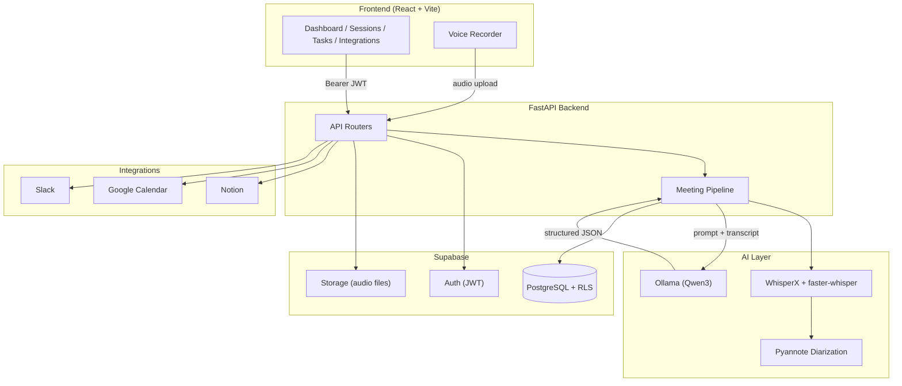
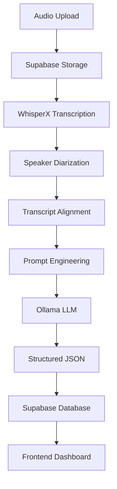

# ActionOS AI

ActionOS AI is a meeting intelligence platform that transforms audio recordings into structured, actionable data. It transcribes meetings with speaker diarization, then uses a local LLM to extract tasks, action plans, decisions, risks, and summaries — all stored in Supabase and surfaced through a React dashboard.

Meetings generate commitments that get lost in notes, chat, and memory. ActionOS captures the audio, does the listening, and turns the conversation into a structured task list with owners, deadlines, and reminders — then syncs those tasks to Notion, Google Calendar, and Slack.

---

## Features

- **AI meeting transcription** — WhisperX + faster-whisper for high-accuracy speech-to-text
- **Speaker diarization** — Pyannote-powered speaker attribution ("who said what")
- **Task extraction** — LLM identifies actionable work, owners, priorities, and due dates
- **Meeting summaries** — Concise, factual bullet-point summaries
- **Decisions extraction** — Agreements, approvals, and final choices
- **Risk extraction** — Blockers, dependencies, and concerns with impact/mitigation
- **Action plans** — Multi-step objectives with assigned owners
- **Dashboard** — Overview of today's actions, upcoming reminders, recent meetings, and decisions
- **Session history** — Browse, rename, and delete past meetings
- **Reminder system** — Auto-generated reminders, snooze, and custom reminders
- **Authentication** — Supabase Auth with JWT and Row Level Security
- **Profile system** — Username, full name, avatar, account deletion
- **Notion integration** — OAuth, database selection, task sync
- **Google Calendar integration** — OAuth, task sync as calendar events
- **Slack integration** — OAuth, channel selection, task sync as messages
- **Docker deployment** — Full-stack Docker Compose with GPU support
- **GPU acceleration** — CUDA 12.6 + NVIDIA Container Toolkit
- **Voice recording** — In-browser audio recording with waveform visualization
- **Task filtering & search** — Filter by priority, status, owner, session, and date
- **Action plan editing** — Add, remove, and update steps
- **Risk management** — Resolve, edit, and delete risks
- **Decision management** — Accept, reject, edit, and delete decisions
- **Model warm-up** — Pre-load audio models before recording to reduce latency

---

## Architecture



---

## Tech Stack

### Frontend

| Technology | Purpose |
|---|---|
| React 19 | UI framework |
| Vite 8 | Build tool & dev server |
| React Router 7 | Client-side routing |
| Tailwind CSS 4 | Styling |
| `@supabase/supabase-js` | Supabase client (auth, database) |
| Motion | Animations |
| Lucide React | Icons |
| WaveSurfer.js | Audio waveform visualization |
| React Loading Skeleton | Loading states |

### Backend

| Technology | Purpose |
|---|---|
| Python 3.12 | Runtime |
| FastAPI | Web framework |
| Uvicorn | ASGI server |
| Pydantic | Data validation |
| python-dotenv | Environment variable loading |
| `supabase-py` | Supabase client (database, storage, auth) |
| `openai` SDK | Ollama OpenAI-compatible API client |
| `notion-client` | Notion API |
| `slack_sdk` | Slack API |
| `google-api-python-client` | Google Calendar API |
| PyJWT / python-jose | JWT handling |
| python-multipart | File upload handling |

### AI

| Technology | Purpose |
|---|---|
| WhisperX | Speech-to-text with word-level alignment |
| faster-whisper | Lightweight transcription |
| Pyannote Audio | Speaker diarization |
| Ollama | Local LLM inference (default: `qwen3:8b`) |
| PyTorch (CUDA) | Deep learning runtime |

### Database

| Technology | Purpose |
|---|---|
| Supabase (PostgreSQL) | Primary database with Row Level Security (RLS) |

### Authentication

| Technology | Purpose |
|---|---|
| Supabase Auth | Email/password, OAuth, JWT issuance |
| JWT Bearer tokens | API authentication |
| Row Level Security | Per-user data isolation |

### Storage

| Technology | Purpose |
|---|---|
| Supabase Storage | Audio file storage (`audio-files` bucket) |

### Deployment

| Technology | Purpose |
|---|---|
| Docker | Containerization |
| Docker Compose | Multi-service orchestration |
| NVIDIA Container Toolkit | GPU passthrough to containers |
| Nginx | Frontend static file serving |

---

## Project Structure

```
ActionOS-AI/
├── backend/
│   ├── main.py                      # FastAPI app entrypoint
│   ├── config.py                    # Centralized configuration
│   ├── auth_supabase.py             # RLS-aware Supabase client factory
│   ├── supabase_client.py           # Default Supabase client
│   ├── supabase_admin.py            # Admin Supabase client
│   ├── routers/                     # API route handlers
│   │   ├── sessions.py
│   │   ├── actions.py
│   │   ├── risks.py
│   │   ├── decisions.py
│   │   ├── reminders.py
│   │   ├── uploads.py
│   │   ├── extraction.py
│   │   ├── integrations.py
│   │   └── profile.py
│   ├── services/                    # Business logic
│   │   ├── meeting_pipeline_service.py
│   │   ├── extraction_service.py
│   │   ├── whisperx_service.py
│   │   ├── transcription.py
│   │   ├── model_manager.py
│   │   ├── normalize_service.py
│   │   ├── action_service.py
│   │   ├── session_service.py
│   │   ├── date_service.py
│   │   └── ai/
│   │       ├── factory.py
│   │       ├── base.py
│   │       └── providers/
│   │           └── ollama_provider.py
│   ├── integrations/                # Third-party OAuth + sync
│   │   ├── notion/
│   │   ├── google/
│   │   └── slack/
│   ├── repositories/                # Database access layer
│   ├── schemas/                     # Pydantic models
│   ├── prompts/                     # LLM system prompts
│   ├── dependencies/                # FastAPI dependencies
│   ├── Dockerfile
│   └── requirements.txt
├── frontend/
│   ├── src/
│   │   ├── App.jsx                  # Routes
│   │   ├── main.jsx                 # Entry point
│   │   ├── auth/                    # Auth context & protected routes
│   │   ├── lib/                     # API client & Supabase client
│   │   ├── pages/                   # Dashboard, Sessions, Tasks, etc.
│   │   ├── components/              # Reusable UI components
│   │   └── layouts/                 # App layout
│   ├── Dockerfile
│   └── package.json
├── scripts/
│   └── pull-ollama-model.sh
├── docker-compose.yml
├── docker-compose.dev.yml
├── .env.example
└── TODO.md
```

---

## Requirements

| Requirement | Version | Notes |
|---|---|---|
| Docker Desktop | Latest | For containerized deployment |
| NVIDIA GPU | Optional but recommended | Required for GPU-accelerated transcription |
| NVIDIA Container Toolkit | Latest | For Docker GPU passthrough |
| Python | 3.12 | For local backend development |
| Node.js | 20+ | For local frontend development |
| Ollama | Latest | For local LLM inference |
| HuggingFace token | — | Required for WhisperX diarization (Pyannote) |
| Supabase project | — | Database, auth, and storage |

---

## Local Development

### 1. Clone the repository

```bash
git clone https://github.com/KrishnaPa3/actionos-ai.git
cd actionos-ai
```

### 2. Configure environment variables

Copy the template and fill in your values:

```bash
cp .env.example .env
```

For local development (without Docker), you also need:

```bash
cp .env.example backend/.env
cp .env.example frontend/.env
```

Edit `.env`, `backend/.env`, and `frontend/.env` with your Supabase credentials, HuggingFace token, and integration keys.

### 3. Start Ollama

Install [Ollama](https://ollama.com) and pull the model:

```bash
ollama pull qwen3:8b
```

Ollama runs on `http://localhost:11434` by default.

### 4. Start the backend

```bash
cd backend
python -m venv venv
source venv/bin/activate    # Windows: venv\Scripts\activate
pip install -r requirements.txt
uvicorn main:app --reload --host 0.0.0.0 --port 8000
```

The backend runs on `http://localhost:8000`.

### 5. Start the frontend

```bash
cd frontend
npm install
npm run dev
```

The frontend runs on `http://localhost:5173`.

---

## Docker Development

### Build and start all services

```bash
docker compose up -d --build
```

This starts three services:

| Service | Port | Description |
|---|---|---|
| `ollama` | 11434 | Local LLM inference server |
| `backend` | 8000 | FastAPI application (GPU-enabled) |
| `frontend` | 5173 | React app served via nginx |

### Pull the Ollama model (first run only)

After the containers are running, pull the model into the Ollama container:

```bash
./scripts/pull-ollama-model.sh
```

### Development with hot-reload

For live code reloading, use the dev override:

```bash
docker compose -f docker-compose.yml -f docker-compose.dev.yml up -d
```

### Stop all services

```bash
docker compose down
```

### Volumes

The following persistent Docker volumes are created:

| Volume | Purpose |
|---|---|
| `actionos_ollama_models` | Ollama model storage |
| `actionos_huggingface_cache` | HuggingFace model cache (WhisperX, Pyannote) |
| `actionos_whisper_cache` | Whisper model cache |
| `actionos_torch_cache` | PyTorch model cache |
| `actionos_uploads` | Uploaded audio files |

### GPU requirements

The backend and Ollama services use `runtime: nvidia` for GPU acceleration. You need:

1. An NVIDIA GPU with CUDA 12.6+ support
2. NVIDIA drivers installed on the host
3. NVIDIA Container Toolkit configured

Without a GPU, the services will fall back to CPU mode (significantly slower transcription).

---

## Environment Variables

### Supabase

| Variable | Required | Description |
|---|---|---|
| `SUPABASE_URL` | Yes | Supabase project URL |
| `SUPABASE_KEY` | Yes | Supabase anon key |
| `SUPABASE_SERVICE_ROLE_KEY` | Yes | Supabase service role key (admin operations) |
| `SUPABASE_JWT_SECRET` | No | Supabase JWT secret |

### AI

| Variable | Required | Default | Description |
|---|---|---|---|
| `AI_PROVIDER` | No | `ollama` | AI provider (only `ollama` is implemented) |
| `OLLAMA_MODEL` | No | `qwen3:8b` | Ollama model name |
| `OLLAMA_BASE_URL` | No | `http://localhost:11434/v1` | Ollama API URL (set automatically in Docker) |
| `HF_TOKEN` | Yes | — | HuggingFace token for Pyannote diarization |

> **Note:** `OPENAI_API_KEY`, `GEMINI_API_KEY`, and `ANTHROPIC_API_KEY` are defined in the configuration but the providers are **not yet implemented**. Only `ollama` is supported.

### OAuth (Integrations)

| Variable | Required | Description |
|---|---|---|
| `NOTION_CLIENT_ID` | No | Notion OAuth client ID |
| `NOTION_CLIENT_SECRET` | No | Notion OAuth client secret |
| `NOTION_REDIRECT_URI` | No | Notion OAuth redirect URI (defaults to `{BACKEND_URL}/oauth/notion/callback`) |
| `NOTION_API_KEY` | No | Notion internal integration key |
| `NOTION_DATABASE_ID` | No | Default Notion database ID |
| `GOOGLE_CLIENT_ID` | No | Google OAuth client ID |
| `GOOGLE_CLIENT_SECRET` | No | Google OAuth client secret |
| `GOOGLE_REDIRECT_URI` | No | Google OAuth redirect URI (defaults to `{BACKEND_URL}/oauth/google/callback`) |
| `SLACK_CLIENT_ID` | No | Slack OAuth client ID |
| `SLACK_CLIENT_SECRET` | No | Slack OAuth client secret |
| `SLACK_REDIRECT_URI` | No | Slack OAuth redirect URI (defaults to `{BACKEND_URL}/oauth/slack/callback`) |

### Frontend (Vite build-time)

| Variable | Required | Description |
|---|---|---|
| `VITE_SUPABASE_URL` | Yes | Supabase project URL |
| `VITE_SUPABASE_ANON_KEY` | Yes | Supabase anon key |
| `VITE_API_URL` | No | Backend API URL |
| `VITE_SITE_URL` | No | Frontend site URL |

### Docker

| Variable | Required | Default | Description |
|---|---|---|---|
| `FRONTEND_URL` | No | `http://localhost:5173` | Browser-accessible frontend URL |
| `BACKEND_URL` | No | `http://localhost:8000` | Browser-accessible backend URL |
| `CORS_ORIGINS` | No | `http://localhost:5173` | Comma-separated CORS origins |
| `DEBUG_TIMING` | No | `1` | Enable timing instrumentation |
| `UPLOAD_DIR` | No | `/app/uploads` | Audio upload directory |

---

## API Overview

All endpoints require an `Authorization: Bearer <JWT>` header except OAuth callbacks.

### Sessions

| Method | Path | Description |
|---|---|---|
| `GET` | `/sessions` | List all sessions with task counts |
| `GET` | `/session/{session_id}` | Get a single session |
| `GET` | `/session/{session_id}/actions` | Get actions for a session |
| `GET` | `/session/{session_id}/risks` | Get risks for a session |
| `GET` | `/session/{session_id}/decisions` | Get decisions for a session |
| `PATCH` | `/session/{session_id}/rename` | Rename a meeting |
| `DELETE` | `/sessions/{session_id}` | Hard delete a session |
| `PATCH` | `/session/{session_id}/delete` | Soft delete a session |
| `DELETE` | `/session/{session_id}/action-plan/{index}` | Delete an action plan step |
| `PUT` | `/session/{session_id}/action-plan/{index}` | Update an action plan step |

### Actions (Tasks)

| Method | Path | Description |
|---|---|---|
| `GET` | `/actions` | List all actions (supports filters: `search`, `priority`, `status`, `owner`, `session`, `date_mode`, `date`, `end`) |
| `GET` | `/actions/filters` | Get available filter options (owners, sessions) |
| `PATCH` | `/actions/{action_id}` | Update a task |
| `DELETE` | `/actions/{action_id}` | Soft delete a task |
| `PATCH` | `/actions/{action_id}/complete` | Toggle task completion |
| `PATCH` | `/actions/{action_id}/confirm` | Confirm a task |
| `GET` | `/actions/{action_id}/reminders` | Get reminders for a task |
| `POST` | `/actions/{action_id}/reminders` | Create a reminder for a task |

### Risks

| Method | Path | Description |
|---|---|---|
| `PATCH` | `/risks/{risk_id}` | Update a risk |
| `PATCH` | `/risks/{risk_id}/resolve` | Toggle risk resolution |
| `DELETE` | `/risks/{risk_id}` | Soft delete a risk |

### Decisions

| Method | Path | Description |
|---|---|---|
| `GET` | `/decisions` | List all decisions |
| `PATCH` | `/decisions/{decision_id}` | Update a decision |
| `PATCH` | `/decisions/{decision_id}/accept` | Accept a decision |
| `PATCH` | `/decisions/{decision_id}/reject` | Reject a decision |
| `DELETE` | `/decisions/{decision_id}` | Soft delete a decision |

### Reminders

| Method | Path | Description |
|---|---|---|
| `GET` | `/reminders` | List upcoming reminders |
| `PATCH` | `/reminders/{reminder_id}` | Update reminder time |
| `POST` | `/reminders/{reminder_id}/snooze` | Snooze a reminder (`15m`, `30m`, `1h`, `tomorrow`, `custom`) |
| `DELETE` | `/reminders/{reminder_id}` | Delete a reminder |

### Uploads

| Method | Path | Description |
|---|---|---|
| `POST` | `/warm-audio-models` | Pre-load audio models before recording |
| `POST` | `/upload-audio` | Upload and process an audio file |

### Extraction

| Method | Path | Description |
|---|---|---|
| `POST` | `/extract` | Extract structured data from a transcript |

### Integrations

| Method | Path | Description |
|---|---|---|
| `GET` | `/integrations` | List available integrations |
| `GET` | `/oauth/notion/login` | Get Notion OAuth URL |
| `GET` | `/oauth/notion/callback` | Notion OAuth callback |
| `GET` | `/integrations/notion/status` | Notion connection status |
| `GET` | `/integrations/notion/databases` | List accessible Notion databases |
| `POST` | `/integrations/notion/database` | Select a Notion database |
| `POST` | `/integrations/notion/disconnect` | Disconnect Notion |
| `POST` | `/integrations/notion/sync-task` | Sync a task to Notion |
| `GET` | `/oauth/google/login` | Get Google OAuth URL |
| `GET` | `/oauth/google/callback` | Google OAuth callback |
| `GET` | `/integrations/google/status` | Google connection status |
| `POST` | `/integrations/google/disconnect` | Disconnect Google |
| `POST` | `/integrations/google/sync-task` | Sync a task to Google Calendar |
| `GET` | `/oauth/slack/login` | Get Slack OAuth URL |
| `GET` | `/oauth/slack/callback` | Slack OAuth callback |
| `GET` | `/integrations/slack/status` | Slack connection status |
| `GET` | `/integrations/slack/channels` | List Slack channels |
| `POST` | `/integrations/slack/default-channel` | Set default Slack channel |
| `POST` | `/integrations/slack/sync-task` | Sync a task to Slack |
| `POST` | `/integrations/slack/disconnect` | Disconnect Slack |

### Profile

| Method | Path | Description |
|---|---|---|
| `GET` | `/profile` | Get user profile |
| `POST` | `/profile/setup` | Create profile row (idempotent) |
| `PATCH` | `/profile` | Update username / full name |
| `DELETE` | `/profile/delete-account` | Permanently delete account |

### Health

| Method | Path | Description |
|---|---|---|
| `GET` | `/` | Root — service status |
| `GET` | `/health` | Health check for container orchestrators |

---

## AI Pipeline



### Step-by-step

1. **Audio Upload** — The frontend records or uploads an audio file via `POST /upload-audio`.
2. **Supabase Storage** — The raw audio file is uploaded to the `audio-files` bucket in Supabase Storage.
3. **WhisperX Transcription** — The audio is transcribed using WhisperX, producing word-level segments.
4. **Speaker Diarization** — Pyannote identifies speakers and assigns words to speakers.
5. **Transcript Alignment** — WhisperX aligns the transcript with the audio for word-level timestamps.
6. **Prompt Engineering** — The transcript and meeting timestamp are combined with a detailed system prompt that instructs the LLM to extract tasks, action plans, decisions, risks, and summaries.
7. **Ollama LLM** — The prompt is sent to Ollama (default: `qwen3:8b`) via its OpenAI-compatible API with `temperature=0.0` and `response_format=json_object`.
8. **Structured JSON** — The LLM returns structured JSON, which is normalized and validated against the `ExtractionResult` Pydantic schema.
9. **Supabase Database** — The structured data is persisted: session summary, actions (with auto-reminders), risks, and decisions.
10. **Frontend Dashboard** — The results are displayed in the React dashboard with editable cards, risk meters, and action buttons.

### Model warm-up

The `POST /warm-audio-models` endpoint pre-loads the WhisperX, faster-whisper, and Pyannote models when a user starts recording, reducing latency on the first upload.

---

## Integrations

All three integrations use OAuth 2.0 and store connection tokens in the `integrations` table.

### Notion

- **OAuth flow:** `GET /oauth/notion/login` returns an authorization URL. After approval, Notion redirects to `/oauth/notion/callback`, which exchanges the code for an access token and stores it.
- **Database selection:** `GET /integrations/notion/databases` lists accessible databases. `POST /integrations/notion/database` selects one for task sync.
- **Task sync:** `POST /integrations/notion/sync-task` creates a Notion page in the selected database with the task title, owner, due date, priority, and a link back to the ActionOS session.
- **Duplicate protection:** Syncing an already-synced task returns the existing Notion page URL.

### Google Calendar

- **OAuth flow:** `GET /oauth/google/login` returns an authorization URL. After approval, Google redirects to `/oauth/google/callback`, which exchanges the code for an access token (and refresh token) and stores it.
- **Task sync:** `POST /integrations/google/sync-task` creates a Google Calendar event with the task title, description (including owner, priority, meeting name, and session link), and due date.
- **Duplicate protection:** Syncing an already-synced task returns the existing event URL.

### Slack

- **OAuth flow:** `GET /oauth/slack/login` returns an authorization URL. After approval, Slack redirects to `/oauth/slack/callback`, which exchanges the code for a bot access token and stores it.
- **Channel selection:** `GET /integrations/slack/channels` lists visible channels. `POST /integrations/slack/default-channel` saves the user's preferred channel.
- **Task sync:** `POST /integrations/slack/sync-task` posts a formatted message to the default channel with the task title, description, owner, priority, due date, meeting name, and session link.
- **Duplicate protection:** Syncing an already-synced task returns the existing message timestamp.

---

## Deployment

### Production architecture

ActionOS is deployed as three Docker containers:

| Container | Image | Port | Purpose |
|---|---|---|---|
| `actionos-frontend` | `nginx:alpine` | 5173 | Serves the built React static files |
| `actionos-backend` | `nvidia/cuda:12.6.3-runtime-ubuntu24.04` | 8000 | FastAPI application with GPU access |
| `actionos-ollama` | `ollama/ollama:latest` | 11434 | Local LLM inference server |

### Volumes

Persistent volumes ensure model caches and uploaded files survive container restarts:

- `actionos_ollama_models` — Ollama models
- `actionos_huggingface_cache` — HuggingFace models (WhisperX, Pyannote)
- `actionos_whisper_cache` — Whisper models
- `actionos_torch_cache` — PyTorch models
- `actionos_uploads` — Uploaded audio files

### Environment variables

All configuration is injected via environment variables in `docker-compose.yml`, which reads from the root `.env` file. No code changes are required for deployment.

### GPU

The backend and Ollama containers use `runtime: nvidia` with `NVIDIA_VISIBLE_DEVICES=all`. The host must have:

1. NVIDIA GPU drivers
2. NVIDIA Container Toolkit

### Reverse proxy

For production, place a reverse proxy (e.g., Caddy, Traefik, or nginx) in front of the frontend and backend containers to handle domain-based routing and TLS termination. Set `FRONTEND_URL`, `BACKEND_URL`, and `CORS_ORIGINS` to the public-facing URLs.

---

## Performance Notes

- **Model caching** — WhisperX, faster-whisper, and Pyannote models are loaded lazily on the first upload and cached as process-wide singletons. Subsequent uploads reuse the cached models.
- **Persistent Docker volumes** — Model caches persist across container restarts, avoiding re-downloading multi-gigabyte models.
- **GPU acceleration** — CUDA 12.6 with PyTorch enables GPU-accelerated transcription and diarization. Without a GPU, the system falls back to CPU mode (significantly slower).
- **Cold start** — The first audio upload after a backend restart takes longer because models are loaded into memory. Use `POST /warm-audio-models` to pre-load models when a user starts recording.
- **Warm start** — After the first upload, subsequent uploads reuse cached models and the Ollama provider singleton, resulting in faster processing.
- **AI provider singleton** — The Ollama provider is cached as a process-wide singleton, reusing the HTTP client connection pool across requests.

---

## Security

- **Supabase Authentication** — All API endpoints require a valid JWT obtained from Supabase Auth.
- **JWT validation** — The backend validates each request's Bearer token via `supabase.auth.get_user()`.
- **Row Level Security (RLS)** — Each request creates an RLS-aware Supabase client by authenticating PostgREST with the user's access token, ensuring users can only access their own data.
- **Admin operations** — Account deletion and OAuth token storage use the Supabase admin client (service role key), which bypasses RLS. These operations are limited to specific, authenticated endpoints.
- **OAuth** — Notion, Google, and Slack integrations use standard OAuth 2.0 authorization code flow. The `state` parameter contains the user's Supabase ID to verify the OAuth callback.
- **Environment variables** — All secrets (Supabase keys, OAuth client secrets, HuggingFace token) are stored in environment variables, never in code.
- **CORS** — Configurable via `CORS_ORIGINS` environment variable (comma-separated).
- **Non-root container** — The backend Docker container runs as a non-root user (`actionos`).

---

## Roadmap

Based on `TODO.md` and code analysis:

- [ ] **Update `TODO.md`** — The Slack integration backend is implemented but `TODO.md` still marks it as incomplete.
- [ ] **Implement additional AI providers** — `openai`, `gemini`, and `anthropic` are configured in `config.py` but raise `NotImplementedError` in the factory. Only `ollama` is implemented.
- [ ] **Database migration documentation** — `backend/migrate_tasks.py` and `backend/MIGRATION_GUIDE.md` exist but migration status is not documented in the README.

---

## Screenshots

> Screenshots will be added here.

<!--


-->

---

## Contributing

1. Fork the repository
2. Create a feature branch (`git checkout -b feature/amazing-feature`)
3. Commit your changes (`git commit -m 'Add amazing feature'`)
4. Push to the branch (`git push origin feature/amazing-feature`)
5. Open a Pull Request

### Development setup

See [Local Development](#local-development) for instructions on running the project without Docker.

### Code style

- **Backend:** Follow PEP 8. Use type hints. Keep routers thin — business logic belongs in `services/` and `repositories/`.
- **Frontend:** Use functional components with hooks. Follow the existing file structure (`pages/`, `components/`, `lib/`).

### Reporting issues

When reporting an issue, include:

- Steps to reproduce
- Expected vs. actual behavior
- Environment (Docker or local, GPU or CPU, browser)
- Relevant logs

---

## License

MIT License. See [LICENSE](LICENSE) for details.

> **Note:** A `LICENSE` file is not yet present in the repository. This is a placeholder — add a `LICENSE` file with the full MIT License text before distribution.